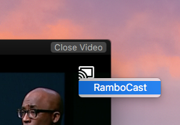
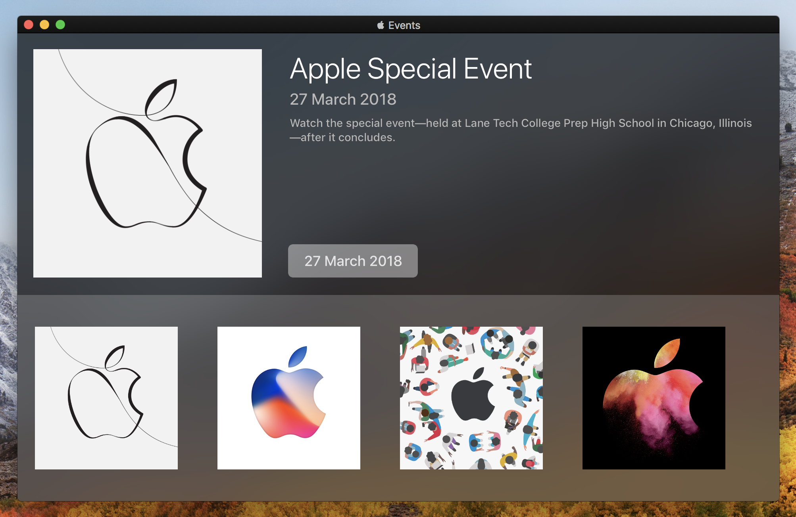
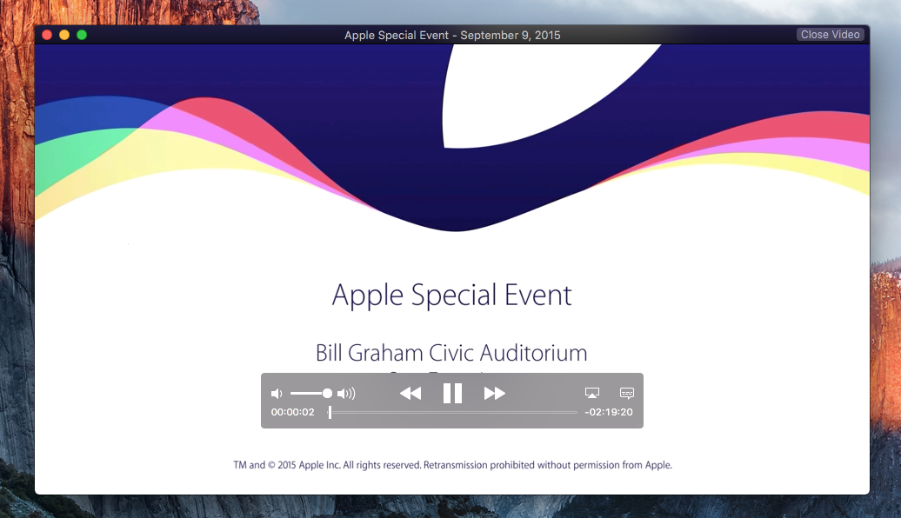
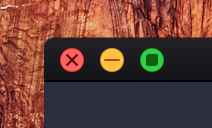
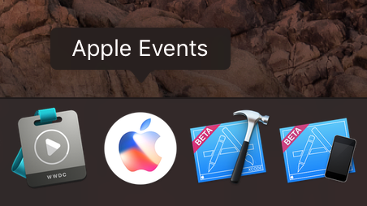

If you want to support my open source projects financially, you can do so by purchasing a copy of [BrowserFreedom](https://getbrowserfreedom.com) or [Mediunic](https://itunes.apple.com/app/mediunic-medium-client/id1088945121?mt=12) 😁

# The unofficial Apple Events app for macOS

This is the unofficial Apple Events app for macOS, inspired by the official Apple TV Events app.

Use this app to watch Apple's special events on your Mac while you work.

**⬇️ [Click here to download the latest release](https://raw.githubusercontent.com/insidegui/AppleEvents/master/Releases/AppleEvents_latest.zip) ⬇️**

**Requires OS X 10.11 or later**

##  Chromecast Support

You can use this app to stream Apple events (both live and on-demand) to your Chromecast, just click the Chromecast button while you're playing a video and select a device from the menu.

*Chromecast streaming is in beta and has only been tested with Chromecast 2 on macOS 10.12*

## Screenshots

The main screen features the next event, the play button will appear as soon as the event starts.

You can select `Play` to play a live or past event.

While the video is playing you can use the "square" button to enter picture in picture mode.

The app icon on the dock features the artwork for the most recent / next live event and shows a "live" indicator when the event is actually live.

